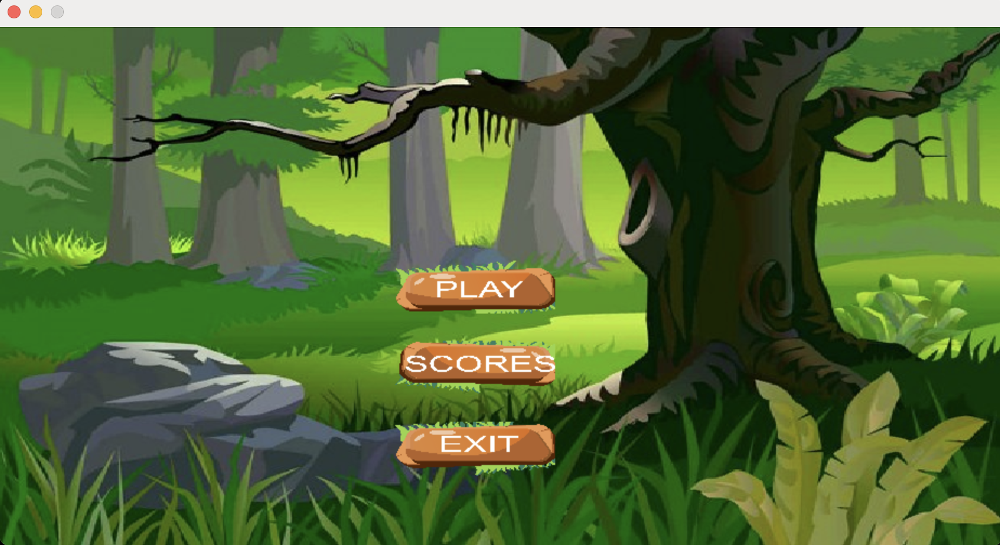
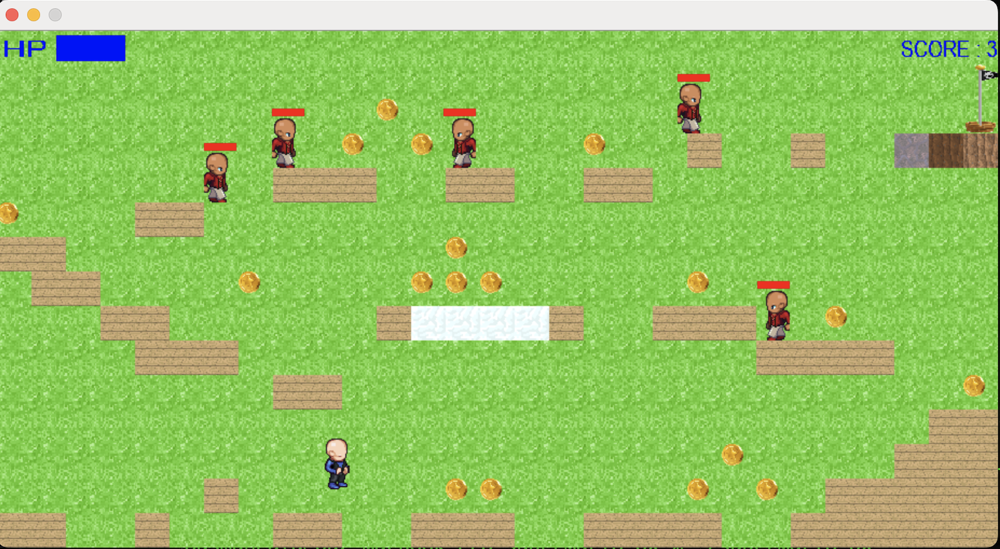
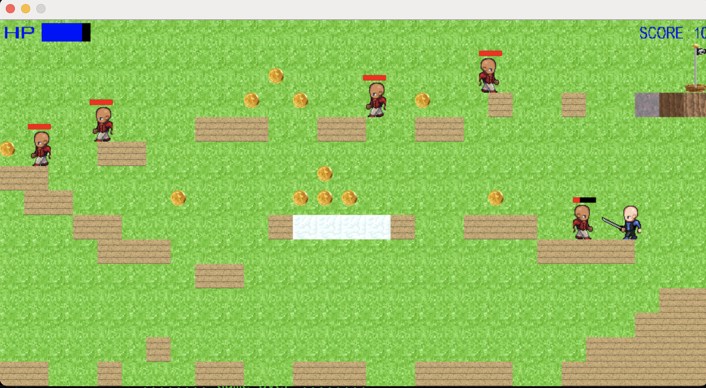
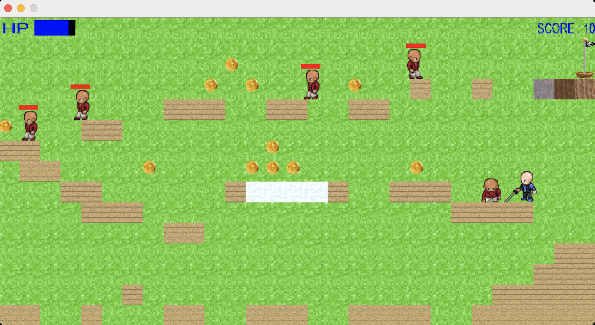
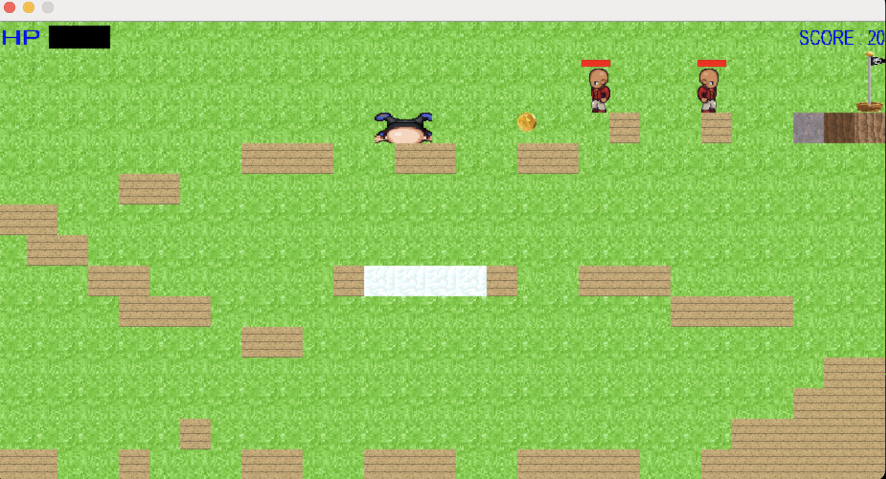
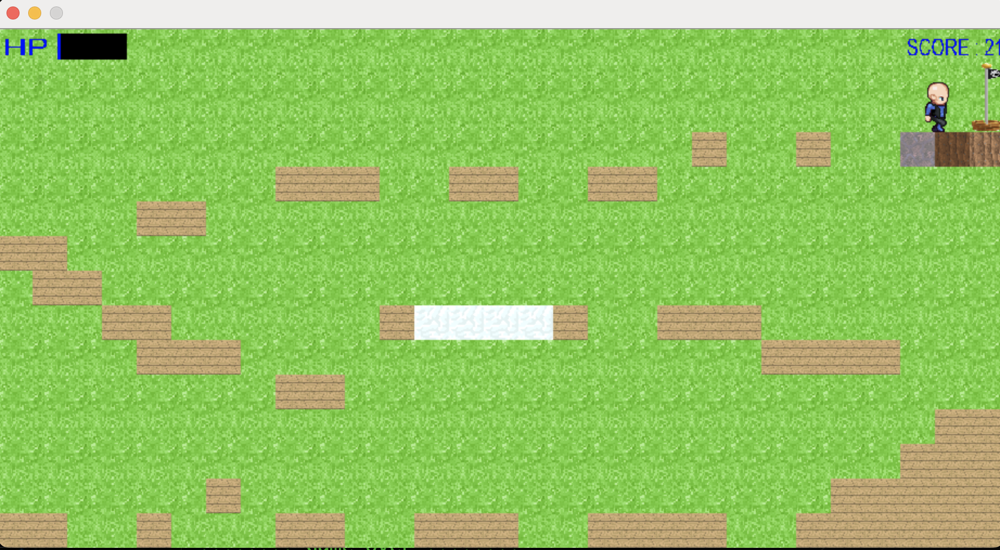

# 🍄 Super Mario OX

> Un jeu de plateforme rétro inspiré de l'univers de Super Mario, développé en **Langage C** avec la bibliothèque **SDL2**.

---

## 📸 Aperçu du Jeu

| **Menu Principal** | **Saut** | **Action & Ennemis** |
|:---:|:---:|:---:|
|  |  |  |
| *Écran d'accueil* | *Un petit saut* | *Attaque* |

| **Système de Combat** | **Personnage mort** | **Finallement** |
|:---:|:---:|:---:|
|  |  |  |
| *Un ennemi de moins* | *Il m'a eu* | *Drapeau de fin* |

---

---

## 🎮 Manuel d'Utilisation

### Introduction
**Super Mario OX** est un jeu de plateforme classique. Traversez les niveaux, évitez les pièges et atteignez le drapeau final pour gagner !

### Commandes
* **Déplacement** : Touches fléchées (`Gauche`, `Droite`).
* **Saut** : Flèche `Haut`.
* **Action** : 
    * `W` : Changer d'arme.
    * `A` : Attaquer (si une arme est équipée).

### Objectif
Collectez un maximum de pièces, éliminez ou évitez les ennemis, et survivez jusqu'au drapeau de fin de niveau.

---

## 🛠️ Compilation et Lancement

Le projet utilise un `Makefile` pour simplifier la compilation avec `gcc`.

### Prérequis
Assurez-vous d'avoir installé les bibliothèques de développement SDL2 :
* **SDL2**
* **SDL2_ttf** (pour l'affichage du texte/scores)

### Installation
   ```bash
   git clone [https://github.com/Ousmane29-maker/superMario_OX.git](https://github.com/Ousmane29-maker/superMario_OX.git)
   cd superMario_OX
   make
   ./superMario_OX
   ```

### 🏗️ Structure du Projet
L'architecture est modulaire, séparant la logique du jeu de l'affichage :

main.c : Point d'entrée et boucle principale du jeu.

world.c / .h : Gestion de la logique physique, du monde, des collisions et des entités.

display.c / .h : Moteur de rendu graphique utilisant SDL2.

liste.c / .h : Gestion des structures de données (listes chaînées) pour les entités mobiles (ennemis, objets).

ressources/ : Contient les sprites, textures et polices de caractères.

### 👤 Auteurs
Projet développé par :

Ousmane DIA

Xiao QIN


### 📄 Licence
Projet réalisé dans le cadre académique. Libre pour consultation et modification à des fins éducatives.